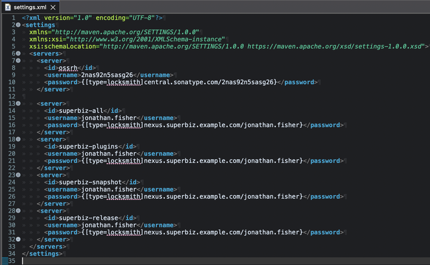
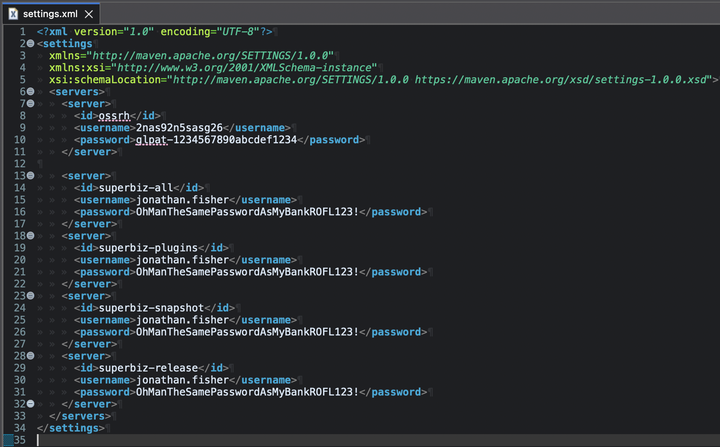
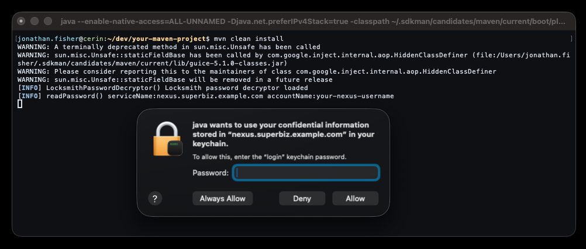

# Locksmith

Give Maven the ability to use the macOS Keychain, or defer to a Unix Socket, giving you the ability to defer to a custom password manager.

⭐ Before you leave, ⭐ Leave a star! ⭐ Thanks! :) ⭐

## What it does

Hide your plaintext secrets/passwords in `~/.m2/settings.xml`. For those in regulated industries, this makes `~/.m2/settings.xml` FIPS-140 compliant.

In general, storing your passwords or any`gplat` tokens in `~/.m2/settings.xml` is a bad idea in the age of user-hostile software and unfettered outbound internet access... After all, we want to avoid having secrets getting sucked into a "misconfigured" LLM or a piece of software with an RCE.

So, for those of us with short attention spans, Locksmith allows your settings.xml to look like this:



Instead of this:



## Operating Theory

The core Locksmith library exposes an API to read generic password items from the macOS Keychain via the Panama FFM. This project contains both a Maven Core Extension and Maven Plugin. The Core Extension and Maven Plugin both use the core Locksmith library. The Maven Core Extension is the primary product of this project.

At startup, Maven loads all jars in its `lib/ext` directory. Sisu discovers the `LocksmithPasswordDecryptor` component from the extension jar. Maven's `DefaultSecDispatcher` looks for `settings-security.xml`; this file must exist, otherwise no custom `PasswordDecryptor`s are invokved (note the setup instructions below give the option of creating essentially a No-Op file). Maven then beings reading `settings.xml`. When it encounters`[type=locksmith]` attribute from the password string, Maven delegates to `LocksmithPasswordDecryptor`. The decryptor then invokes the core Locksmith library to read the password from the macOS Keychain.

If the macOS Keychain is unavailable, as it is happens on Linux, it defers to a Unix Socket. This socket could be anything, like a custom password manager, but a common use case is to support remote builds over ssh, where the socket is forwarded and a local script answers with items from the macOS Keychain.

## Installation

### Prerequisites

- macOS (Intel or Apple Silicon) for local builds
- macOS or Linux for remote builds (with socket agent)
- Java 25+ (Panama FFM needed)
- Maven 3.9+

If your Maven Build requires a lower JDK vesion that Java 25, set up the toolchains plugin for your project, so the Maven JDK and your project JDK are different.

### Procedures

#### Create `settings-security.xml`

Maven's `DefaultSecDispatcher` basically existence-checks `settings-security.xml` before it dispatches to any custom `PasswordDecryptor`s. The file must exist. Here is a script to create a No-Op file if it doesn't:

```bash
if [ ! -f "$HOME/.m2/settings-security.xml" ]; then
  tee ~/.m2/settings-security.xml << 'EOF'
<settingsSecurity>
  <master>{locksmith-managed}</master>
</settingsSecurity>
EOF
fi
```

#### Store your secrets in the MacOS Keychain

```bash
security add-generic-password -U -s "nexus.superbiz.example.com" -a "your-nexus-username" -w
```

The `-w` flag with no value prompts for the password. The `-U` flag updates the item if it already exists.


#### Method 1: Global install (recommended)

A global installation puts the locksmith extension jar in Maven's `lib/ext` folder. This install applies to all Maven builds on the machine. The extension is only used if it's actually configured, making it transparent to any of your existing projects.

You may copy the jar by hand. The better way is to use this script below to download and verify the GPG signature of the extension jar:

```bash
LOCKSMITH_VERSION=1.1.0

gpg --keyserver hkps://keys.openpgp.org --recv-keys 871638A21A7F2C38066471420306A354336B4F0D

rm -rf /tmp/locksmith-stage
mkdir -p /tmp/locksmith-stage
cd /tmp/locksmith-stage

URL=https://repo1.maven.org/maven2/com/github/exabrial/locksmith/locksmith-maven-extension/${LOCKSMITH_VERSION}/locksmith-maven-extension-${LOCKSMITH_VERSION}
curl -sO "${URL}.jar" -O "${URL}.jar.asc"

gpg --verify "locksmith-maven-extension-${LOCKSMITH_VERSION}.jar.asc"

EXT_DIR="$(mvn --version | sed -n 's/Maven home: //p')/lib/ext"
mv -v "locksmith-maven-extension-${LOCKSMITH_VERSION}.jar" "${EXT_DIR}/"

rm -rfv /tmp/locksmith-stage
```


#### Method 2: Per-project `.mvn/extensions.xml`

This method requires all developers of the project to set up their machines exactly alike, which isn't ideal. Prefer Method 1 when possible.

Create `.mvn/extensions.xml` in the project root:

```xml
<extensions>
    <extension>
        <groupId>com.github.exabrial.locksmith</groupId>
        <artifactId>locksmith-maven-extension</artifactId>
        <version>1.1.0</version>
    </extension>
</extensions>
```

## Usage

### Maven Extension

Reference the Keychain item in `settings.xml`:

```xml
<servers>
    <server>
        <id>my-nexus</id>
        <username>your-nexus-username</username>
        <password>{[type=locksmith]nexus.superbiz.example.com/your-nexus-username}</password>
    </server>
</servers>
```

The format is `{[type=locksmith]serviceName/accountName}`. Maven's `DefaultSecDispatcher` finds the `locksmith` decryptor and reads the password from the Keychain.

On the first access, macOS prompts for your login keychain password:



If all you were trying to do is secure your secrets, thats it! You're done!

### Maven Plugin

This part is not required for normal use. However, you may have secrets you want to store in the macOS keychain that can't be resolved from `settings.xml`. In that case, if the secret can be read from a maven property, you can defer to Locksmith to read them from secure storage.

Essentially, use the Maven plugin when you need a password as a Maven project property for another plugin's configuration exported as a maven property.

```xml
<plugin>
    <groupId>com.github.exabrial.locksmith</groupId>
    <artifactId>locksmith-maven-plugin</artifactId>
    <version>1.1.0</version>
    <executions>
        <execution>
            <goals>
                <goal>read-password</goal>
            </goals>
            <configuration>
                <serviceName>nexus.superbiz.example.com</serviceName>
                <accountName>your-nexus-username</accountName>
                <passwordProperty>nexus.password</passwordProperty>
            </configuration>
        </execution>
    </executions>
</plugin>
```

After the `validate` phase, `${nexus.password}` is available to all subsequent plugins.

#### Plugin Parameters

| Parameter | Required | Default | Description |
|---|---|---|---|
| `serviceName` | yes | | Keychain item name |
| `accountName` | yes | | Keychain account name |
| `passwordProperty` | yes | `password` | Maven project property to set |


### Handy Commands


#### Method 1: Global uninstallation

```
rm -rfv "$(mvn --version | sed -n 's/Maven home: //p')/lib/ext/"/locksmith*
```


#### Verify an item in the macOS Keychain

```bash
security find-generic-password -s "nexus.superbiz.example.com" -a "your-nexus-username" -w
```

#### Reset the ACL for your Keychain Entry

This gives you the macOS ACL prompt back:

```bash
security set-generic-password-partition-list -S "" -s "nexus.superbiz.example.com" -a "your-nexus-username" -k "$(read -sp 'Keychain password: ' p; echo $p)"
```

## Socket shenanigans

Locksmith can read credentials from a Unix Socket as well. This could be anything technically, like a custom password manager, but a common use case is to support remote builds running over an ssh connection.


### Socket path resolution

Locksmith checks these paths in order. The first one that exists wins.

1. `LOCKSMITH_SOCK` environment variable
2. `$XDG_RUNTIME_DIR/locksmith.sock` (Linux default)
3. `$HOME/.locksmith/locksmith.sock` (macOS default)

Set `LOCKSMITH_SOCK` to override when the default paths do not fit your environment.

### Remote Builds

A small shell script agent runs on your Mac and serves Keychain lookups over a Unix socket. SSH forwards that socket to the remote machine. No secrets are stored remotely.  A `launchd` socket-activated agent calls `security find-generic-password` and returns the password.

#### Setup: Mac agent host

##### Local Agent Script

```bash
sudo tee /usr/local/bin/locksmith-agent.sh << 'SCRIPT'
#!/bin/sh
read -r request
service="${request%%/*}"
account="${request#*/}"
security find-generic-password -s "$service" -a "$account" -w
SCRIPT
sudo chmod 755 /usr/local/bin/locksmith-agent.sh
```

##### launchd plist with socket activation

```bash
mkdir -p ~/.locksmith
tee ~/Library/LaunchAgents/com.github.exabrial.locksmith-agent.plist << 'PLIST'
<?xml version="1.0" encoding="UTF-8"?>
<!DOCTYPE plist PUBLIC "-//Apple//DTD PLIST 1.0//EN" "http://www.apple.com/DTDs/PropertyList-1.0.dtd">
<plist version="1.0">
<dict>
    <key>Label</key>
    <string>com.github.exabrial.locksmith-agent</string>
    <key>ProgramArguments</key>
    <array>
        <string>/usr/local/bin/locksmith-agent.sh</string>
    </array>
    <key>Sockets</key>
    <dict>
        <key>Listeners</key>
        <dict>
            <key>SockPathName</key>
            <string>/Users/YOURUSERNAME/.locksmith/locksmith.sock</string>
        </dict>
    </dict>
    <key>inetdCompatibility</key>
    <dict>
        <key>Wait</key>
        <false/>
    </dict>
    <key>StandardErrorPath</key>
    <string>/Users/YOURUSERNAME/.locksmith/agent.log</string>
</dict>
</plist>
PLIST
```

```bash
sed -i '' "s/YOURUSERNAME/$(whoami)/g" ~/Library/LaunchAgents/com.github.exabrial.locksmith-agent.plist
launchctl bootout gui/$(id -u)/com.github.exabrial.locksmith-agent
rm -f ~/.locksmith/locksmith.sock
launchctl bootstrap gui/$(id -u) ~/Library/LaunchAgents/com.github.exabrial.locksmith-agent.plist
```

##### ssh configuration

Add the socket forward to `~/.ssh/config`

```bash
REMOTE_UID=$(ssh build.superbiz.example.com id -u)
tee -a ~/.ssh/config << SSHCONF

Host build.superbiz.example.com
    RemoteForward /run/user/${REMOTE_UID}/locksmith.sock /Users/$(whoami)/.locksmith/locksmith.sock
SSHCONF
```

##### Remote machine

Install the extension jar into `lib/ext` and create a `settings-security.xml` if it doesn't exist; the same way as a local machine.

## Development

### Modules

| Module | What it does |
|---|---|
| `locksmith` | Core library. Reads a generic password item from the macOS Keychain with Java FFM (Panama). Falls back to a forwarded socket if the Keychain is not available. |
| `locksmith-maven-plugin` | Maven plugin. Sets a Keychain password as a Maven project property during the `validate` phase. Use this when a plugin reads credentials from a property. |
| `locksmith-maven-extension` | Maven core extension. Decrypts `<server>` passwords in `settings.xml` at startup. Use this for `<distributionManagement>`, repository authentication, and wagon credentials. |

#### Notes to future self

...so I don't forget how to do this when Apple breaks backwards compatibility next year.

##### Installing jextract

```bash
sdk install jextract
```

##### Regenerate FFM bindings

```bash
cd ~/opensource/locksmith

SDK=$(xcrun --show-sdk-path)

mkdir -p /tmp/locksmith-headers
ln -sf $SDK/System/Library/Frameworks/Security.framework/Headers /tmp/locksmith-headers/Security
ln -sf $SDK/System/Library/Frameworks/CoreFoundation.framework/Headers /tmp/locksmith-headers/CoreFoundation

cat > /tmp/locksmith-headers/locksmith.h << 'EOF'
#include <CoreFoundation/CoreFoundation.h>
#include <Security/SecItem.h>
EOF

jextract --target-package com.github.exabrial.locksmith.macos \
    --header-class-name MacSecurity \
    --include-function SecItemCopyMatching \
    --include-function CFDictionaryCreate \
    --include-function CFRelease \
    --include-function CFDataGetLength \
    --include-function CFDataGetBytePtr \
    --include-function CFStringCreateWithCString \
    --include-var kSecClass \
    --include-var kSecClassGenericPassword \
    --include-var kSecAttrService \
    --include-var kSecAttrAccount \
    --include-var kSecReturnData \
    --include-var kSecMatchLimit \
    --include-var kSecMatchLimitOne \
    --include-var kCFAllocatorDefault \
    --include-var kCFBooleanTrue \
    --include-var kCFTypeDictionaryKeyCallBacks \
    --include-var kCFTypeDictionaryValueCallBacks \
    --include-typedef CFDictionaryKeyCallBacks \
    --include-typedef CFDictionaryValueCallBacks \
    --library Security \
    --library CoreFoundation \
    -I /tmp/locksmith-headers \
    -I $SDK/usr/include \
    --output locksmith/src/main/java \
    /tmp/locksmith-headers/locksmith.h
```

##### Install during development:

```
cd ~/opensource/locksmith
rm -rfv "$(dirname "$(which mvn)")/../lib/ext/"/locksmith*
mvn clean install
cp -v locksmith-maven-extension/target/locksmith-maven-extension-*.jar "$(dirname "$(which mvn)")/../lib/ext/"
```
